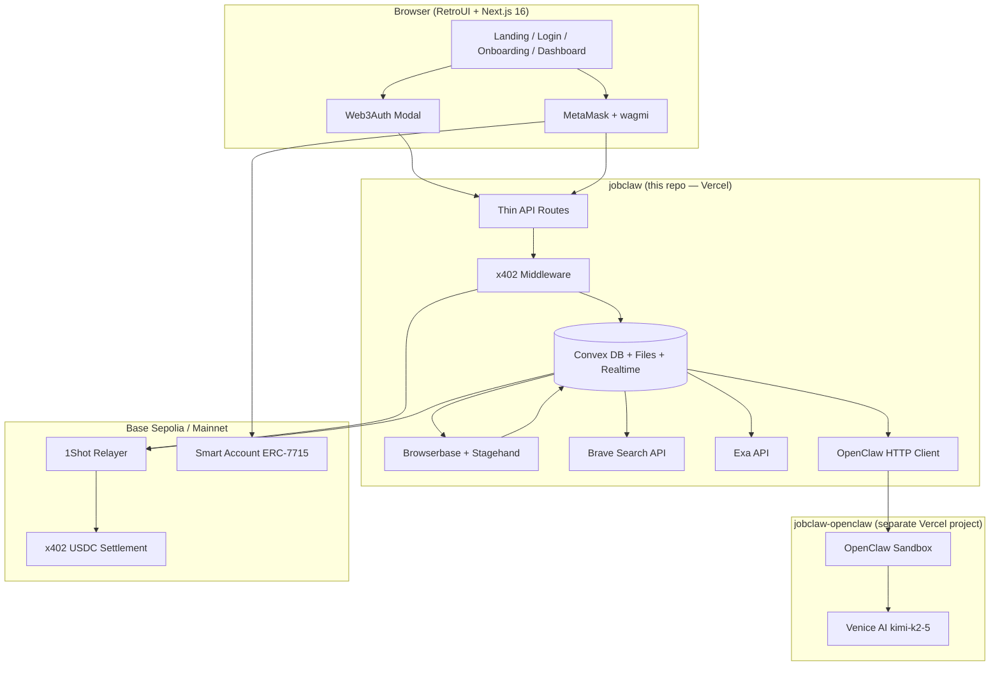

# Architecture

> **Purpose:** Technical source of truth — stack, flows, Convex schema, env vars, deployment, skills/MCP inventory.  
> **Read when:** Backend work, integrations, auth, onchain, agent pipeline, deploy.  
> **Product scope:** `project-overview.md` · **Code patterns:** `code-standards.md` · **Library usage:** `library-docs.md`  
> **Glossary:** `context/README.md`

**JobClaw** — autonomous job-hunting agent for the **MetaMask Smart Accounts Kit × 1Shot API × Venice AI Dev Cook Off**.

Every AI agent must read **`AGENTS.md`** first, then **`context/README.md`**, then this file when doing technical work.

---

## Table of Contents

1. [High-Level System Map](#high-level-system-map)
2. [Technology Stack](#technology-stack)
3. [Dual-Repo Topology](#dual-repo-topology)
4. [Agent Tooling — Skills & MCP](#agent-tooling--skills--mcp)
5. [Folder Structure](#folder-structure)
6. [System Boundaries & Ownership](#system-boundaries--ownership)
7. [Runtime Architecture](#runtime-architecture)
8. [Data Flows](#data-flows)
9. [Convex Schema](#convex-schema)
10. [Authentication & Authorization](#authentication--authorization)
11. [Onchain & x402 Layer](#onchain--x402-layer)
12. [Agent Pipeline (Discovery → Apply)](#agent-pipeline-discovery--apply)
13. [Environment Variables](#environment-variables)
14. [Deployment & Infrastructure](#deployment--infrastructure)
15. [Prize-Track → Component Mapping](#prize-track--component-mapping)
16. [Invariants](#invariants)

---

## High-Level System Map



**Core principle:** UI and thin routes live in Next.js. All durable state and long-running work live in Convex actions. Reasoning lives in OpenClaw + Venice. Browser execution lives in Browserbase — never in OpenClaw.

---

## Technology Stack

| Layer | Tool | Version / Default | Purpose |
|-------|------|-------------------|---------|
| Framework | Next.js | 16 (App Router) | Frontend, thin API routes, middleware |
| UI | RetroUI + Tailwind | v4 | Brutalist components in `components/retroui/` |
| Auth (onboarding) | Web3Auth | `@web3auth/modal` | **Primary entry** — social login, resume, preferences |
| Auth (Web3) | wagmi + viem + MetaMask SDK | latest | Wallet connect, SIWE, Smart Accounts Kit |
| Smart accounts | MetaMask Smart Accounts Kit | ERC-7715 | Scoped delegation for autonomous agent |
| Onchain relay | 1Shot Permissionless Relayer | EIP-7702 + 7710 | Upgrade + delegated execution, USDC gas |
| Payments | x402 + 1Shot facilitator | HTTP 402 | Micropayments on hunt / apply / analyze-url |
| Database | Convex | — | Schema, queries, mutations, actions, files, crons |
| Realtime UI | Convex `useQuery` | — | Live agent logs, application status |
| Agent brain | OpenClaw | `@vercel/vclaw` | Reasoning sandbox (separate repo) |
| LLM | Venice AI | `venice/kimi-k2-5` | Match, personalize, form answers |
| Job discovery | Exa + LinkedIn | `exa-js` + Browserbase | Broad search + board browsing |
| URL analysis | Brave Search + Browserbase | REST API | User-pasted official job URLs |
| Browser automation | Browserbase + Stagehand | Venice as LLM | Search, extract, fill, submit |
| Deploy | Vercel | Hobby (demo OK) | Both repos |
| Chain (dev) | Base Sepolia | chainId `84532` | x402 dev payments |
| Chain (demo video) | Base mainnet | chainId `8453` | **Required for 1Shot relayer prize** |

**Removed — do not use:** InsForge, Adzuna, PostHog, Clerk, Neon, OpenAI GPT-4o as primary model.

---

## Dual-Repo Topology

| Repo | Create / Deploy | Owns | Must NOT own |
|------|-----------------|------|--------------|
| **`jobclaw`** (this repo) | Vercel git push or `vercel deploy` | Next.js UI, Convex, x402, Browserbase, Exa, Brave, Web3Auth, MetaMask onboarding, demo dashboard | Venice config, OpenClaw sandbox lifecycle |
| **`jobclaw-openclaw`** | `npx @vercel/vclaw create` | OpenClaw gateway, Venice provider, reasoning endpoints | Browserbase, Stagehand, Convex writes |

```bash
# OpenClaw repo bootstrap (run once, separate directory)
npx @vercel/vclaw create \
  --scope YOUR_TEAM \
  --name jobclaw-openclaw \
  --dir ~/dev/jobclaw-openclaw \
  --clone
```

After create: configure Venice (`venice/kimi-k2-5`), allowlist `api.venice.ai` in sandbox egress, run `vclaw verify`.

---

## Agent Tooling — Skills & MCP

AI agents must use installed **skills** and **MCP servers** before guessing APIs. Authority order:

```
AGENTS.md → context/architecture.md (this file) → installed skill → Convex MCP (schema/runtime) OR Context7 MCP (API docs) → context/library-docs.md → training data
```

### Required reading

| Order | Document | When |
|-------|----------|------|
| 1 | `AGENTS.md` | Every session |
| 2 | `context/README.md` | Document map, glossary, task router |
| 3 | `context/progress-tracker.md` | Current status |
| 4 | `context/project-overview.md` | Product scope and demo script |
| 5 | `context/architecture.md` | System design (this file) |
| 6 | `context/code-standards.md` | Implementation patterns |
| 7 | `context/library-docs.md` | Per-library project rules |
| 8 | `context/build-plan.md` | Phase order and feature list |

### Repo-local skills (`.agents/skills/`)

These live **in this repository** and govern agent workflow. Read the relevant `SKILL.md` before acting.

| Skill | Path | Use when |
|-------|------|----------|
| **architect** | `.agents/skills/architect/SKILL.md` | Before any complex feature — align language, surface decisions, confirm plan |
| **review** | `.agents/skills/review/SKILL.md` | Before demo or when code feels off |
| **recover** | `.agents/skills/recover/SKILL.md` | Same problem persists after one fix — stop and recover |
| **imprint** | `.agents/skills/imprint/SKILL.md` | After new UI components — capture patterns |
| **remember** | `.agents/skills/remember/SKILL.md` | Multi-session features — save/restore state |
| **fetch** | `.agents/skills/fetch/SKILL.md` | Structured external data fetching patterns |
| **functions** | `.agents/skills/functions/SKILL.md` | Serverless / function patterns reference |

**Slash commands** (from `AGENTS.md`): `/architect`, `/review`, `/recover`, `/imprint`, `/remember save`, `/remember restore`.

### Global skills (`~/.agents/skills/` + `~/.claude/skills/`)

Installed **locally on the developer machine**. Read the skill file before implementing in that domain.

| Skill | Path | JobClaw use |
|-------|------|-------------|
| **deploy-to-vercel** | `~/.agents/skills/deploy-to-vercel/SKILL.md` | Deploy previews, link project, env vars |
| **web3auth** | `~/.agents/skills/web3auth/SKILL.md` | Web3Auth modal, social login, embedded wallets |
| **ai-sdk** | `~/.agents/skills/ai-sdk/SKILL.md` | If adding Vercel AI SDK helpers |
| **context7** | `~/.agents/skills/context7/SKILL.md` | Context7 REST fallback when MCP unavailable |
| **vercel-react-best-practices** | `~/.claude/skills/vercel-react-best-practices/SKILL.md` | React/Next performance patterns |
| **frontend-design** | `~/.claude/skills/frontend-design/SKILL.md` | Distinctive UI when extending RetroUI |
| **systematic-debugging** | `~/.claude/skills/systematic-debugging/SKILL.md` | Structured debug when `/recover` triggers |
| **writing-plans** / **executing-plans** | `~/.claude/skills/writing-plans/`, `executing-plans/` | Multi-phase implementation |
| **browser** | `~/.agents/skills/browser/SKILL.md` | Local browser automation reference |

### Vercel plugin skills (global — via Vercel CLI / plugin)

Installed with the **Vercel Claude plugin**. Path on this machine:

`~/.claude/plugins/cache/claude-plugins-official/vercel/0.42.1/skills/`

**Always load the relevant Vercel skill before touching that area.** Key skills for JobClaw:

| Skill | Use for |
|-------|---------|
| `nextjs` | App Router, Server Components, middleware, caching |
| `next-cache-components` | PPR, `use cache`, cache tags |
| `vercel-functions` | Route handlers, timeouts, Fluid Compute |
| `deployments-cicd` | Preview vs production, build logs |
| `env-vars` | `NEXT_PUBLIC_*` vs server secrets |
| `auth` | Marketplace auth patterns (reference only — we use Web3Auth + MetaMask) |
| `ai-sdk` / `ai-gateway` | AI provider routing if needed |
| `workflow` | Durable workflows (future cron orchestration) |
| `vercel-cli` | `vercel deploy`, `vercel env`, `vercel link` |
| `bootstrap` | First-time repo + Vercel linking |
| `shadcn` | RetroUI/shadcn registry installs |
| `turbopack` | Dev server / build issues |

Use **`npx vercel`** (globally or via npx) for CLI operations — see `deploy-to-vercel` skill for the full deploy flow.

### Required MCP servers

MCP tools are available in Cursor. **Read tool schema in `mcps/<server>/tools/` before calling.**

| MCP Server | Identifier | Required for | JobClaw tasks |
|------------|------------|--------------|---------------|
| **Convex** | `user-convex` | **Yes — schema, functions, runtime** | Inspect tables/schema, function specs, run queries/mutations/actions, read UDF logs, env vars, debug actions |
| **Context7** | `user-context7` | **Yes — library docs** | Next.js, Convex API patterns, Web3Auth, MetaMask Kit, Stagehand, x402, Venice |
| **Vercel** | `plugin-vercel-vercel` | **Yes — deploy & platform** | Deploy, env vars, build logs, `search_vercel_documentation` |
| **Cursor IDE Browser** | `cursor-ide-browser` | Demo / E2E verification | Manual UI testing, demo rehearsal — **not** production apply (use Browserbase) |
| **Playwright** | `user-playwright` | Optional — automated E2E | Login flow, dashboard smoke tests |
| **Chrome DevTools** | `user-chrome-devtools` | Optional — debug | Network/console inspection during auth/x402 debug |
| **Filesystem** | `user-filesystem` | Optional | Bulk file reads when exploring |

**Convex MCP workflow** (mandatory for schema, functions, and debugging):

The **Convex MCP server is installed locally** — use it to understand and verify the live deployment before and after editing Convex code. Read tool schemas in `mcps/user-convex/tools/` before calling.

1. **`status`** — get deployment selector for this project (`projectDir`: workspace root). Default to **dev** deployment unless debugging production.
2. **`tables`** — list tables + declared/inferred schema. Use when writing or validating `convex/schema.ts`.
3. **`functionSpec`** — list all queries, mutations, actions with arg validators and visibility. Use before calling functions from the app or writing new exports.
4. **`run`** — execute a query/mutation/action on the deployment (JSON-encoded args). Use to verify handlers work after changes.
5. **`data`** — read paginated rows from a table. Use to inspect `applications`, `agentRuns`, `onchainLogs` during debug/demo prep.
6. **`logs`** — fetch UDF execution logs; set `status: "failure"` when debugging action errors.
7. **`envList` / `envGet` / `envSet`** — inspect or set Convex deployment env vars (server-side secrets for actions).
8. **`runOneoffQuery`** — ad-hoc read queries when exploring data shape.
9. **`insights`** — deployment health / usage signals when troubleshooting.

**When to prefer Convex MCP vs Context7:**

| Need | Use |
|------|-----|
| Live schema, table names, indexes | **Convex MCP** `tables` |
| What functions exist and their args | **Convex MCP** `functionSpec` |
| Test a mutation/action after edit | **Convex MCP** `run` |
| Why an action failed | **Convex MCP** `logs` (status: failure) |
| Convex API syntax, patterns, migrations | **Context7** `/get-convex/convex` or convex.dev docs |
| General library docs (non-deployment) | **Context7** |

**Context7 workflow** (mandatory for third-party library API docs):

1. `resolve-library-id` with library name + question
2. Pick best match (`/org/project`, High reputation preferred)
3. `query-docs` with full question — not single keywords
4. Implement using fetched docs

**Vercel MCP workflow** (mandatory for deploy/debug):

1. `search_vercel_documentation` for platform questions
2. `deploy_to_vercel` / `get_deployment_build_logs` when deploying
3. `get_runtime_logs` when debugging production/preview

**Do not use MCP browser tools for autonomous job apply** — production automation runs on Browserbase + Stagehand in Convex actions only.

---

## Folder Structure

```
/
├── AGENTS.md                           → Agent operating manual (read first)
├── .agents/skills/                     → Repo workflow skills (architect, review, recover…)
├── context/                            → All agent context docs
│   ├── architecture.md                 → This file
│   ├── project-overview.md
│   ├── code-standards.md
│   ├── library-docs.md
│   ├── build-plan.md
│   ├── progress-tracker.md
│   ├── ui-tokens.md
│   ├── ui-rules.md
│   └── ui-registry.md
├── app/
│   ├── layout.tsx                      → Fonts (Archivo Black, Space Grotesk), providers
│   ├── globals.css                     → RetroUI CSS variables
│   ├── page.tsx                        → Landing
│   ├── login/page.tsx                  → Web3Auth primary entry
│   ├── onboarding/
│   │   ├── page.tsx                    → Resume + preferences + consent
│   │   ├── connect-wallet/page.tsx     → MetaMask upgrade + SIWE
│   │   └── permissions/page.tsx        → Smart Accounts Kit + ERC-7715
│   ├── dashboard/
│   │   ├── page.tsx                    → Stats + live logs
│   │   ├── hunt/page.tsx               → Hunt / paste URL / LinkedIn trigger
│   │   ├── onchain/page.tsx            → Tx table + explorer links
│   │   └── applications/[id]/page.tsx  → Match reason + personalized docs
│   └── api/
│       ├── auth/
│       │   ├── web3auth/route.ts       → idToken verify, session cookie
│       │   └── verify/route.ts         → SIWE verify, link wallet
│       ├── jobs/
│       │   ├── hunt/route.ts           → x402-gated hunt
│       │   ├── analyze-url/route.ts    → x402-gated URL analyze + apply
│       │   └── apply/[listingId]/route.ts
│       └── webhooks/1shot/route.ts     → Relayer tx status (prefer over polling)
├── convex/
│   ├── schema.ts
│   ├── users.ts, jobProfiles.ts, resumes.ts, delegations.ts
│   ├── jobListings.ts, applications.ts, agentRuns.ts
│   ├── onchainLogs.ts, browserSessions.ts, x402Payments.ts
│   ├── actions/
│   │   ├── jobHunt.ts                  → Exa + LinkedIn + rank + apply loop
│   │   ├── analyzeAndApply.ts          → Brave + Browserbase + personalize + apply
│   │   └── personalizeDocuments.ts     → Venice resume + cover letter generation
│   └── crons.ts                        → Daily status checks (prefer over Vercel cron)
├── components/
│   ├── retroui/                        → 38 RetroUI components (primary UI kit)
│   ├── layout/                         → Navbar, Footer
│   ├── auth/                           → LoginButtons, WalletUpgradeBanner
│   ├── dashboard/                      → StatsBar, LiveLogDrawer, ApplicationTable, OnchainPanel
│   └── onboarding/                     → ResumeUpload, JobPreferencesForm, PermissionStepper
├── lib/
│   ├── metamask/                       → siwe.ts, smartAccount.ts, permissions.ts
│   ├── web3auth/                       → provider.tsx, config.ts, verifyIdToken.ts
│   ├── openclaw/client.ts              → ensureRunning(), rankJobs(), personalize()
│   ├── x402/middleware.ts, facilitator.ts
│   ├── onchain/relayer.ts              → 1Shot client
│   ├── automation/
│   │   ├── exa-search.ts
│   │   ├── brave-search.ts
│   │   ├── linkedin-search.ts
│   │   ├── job-url-analyze.ts
│   │   ├── stagehand-apply.ts
│   │   ├── apply-pipeline.ts           → Orchestrates full apply flow
│   │   └── session-manager.ts
│   └── utils.ts                        → MATCH_THRESHOLD = 70
├── providers/Web3Provider.tsx          → Web3Auth + wagmi + Convex
└── middleware.ts                       → Session protection
```

---

## System Boundaries & Ownership

| Layer | Owns | Forbidden |
|-------|------|-----------|
| `app/` | Pages, layouts, thin route handlers | Business logic, DB calls, Browserbase |
| `convex/` | All state, actions, crons, file storage | Direct React imports |
| `lib/automation/` | Exa, Brave, LinkedIn, Stagehand, Browserbase | UI components, Convex schema |
| `lib/openclaw/` | HTTP client to OpenClaw sandbox | Browser automation |
| `lib/metamask/` | SIWE, Smart Accounts Kit, ERC-7715 | Web3Auth token logic |
| `lib/x402/` | 402 responses, payment verification | Hunt ranking logic |
| `components/` | Presentation only | Direct external API calls |
| `jobclaw-openclaw` | Venice reasoning, model routing | Browserbase, Convex, x402 |

**Call direction rules:**

- `app/api/*` → verify auth/x402 → schedule Convex action → return `{ runId }`
- Convex actions → call `lib/*` helpers → append `agentRuns.logs` via mutation
- OpenClaw client → POST to external sandbox only — never Stagehand
- Never import `agent/` logic into `components/` (no legacy agent folder — use `lib/automation/`)

---

## Runtime Architecture

### Process model

| Runtime | Workload | Max duration | Examples |
|---------|----------|--------------|----------|
| Next.js Server Component | SSR, static data | Request-bound | Landing, dashboard shell |
| Next.js Route Handler | Auth verify, x402 gate | ≤ 5 min (Hobby) | `/api/jobs/hunt` |
| Convex Query | Realtime reads | Fast | `useQuery(api.applications.list)` |
| Convex Mutation | User writes | Fast | Resume upload metadata |
| Convex Action | External I/O | Long | jobHunt, analyzeAndApply |
| Convex Cron | Scheduled | Periodic | Application status poll |
| Browserbase Session | Browser automation | 2–5 min | LinkedIn search, form fill |
| OpenClaw Sandbox | LLM reasoning | Cold ~60s, warm ~10s | Job ranking, personalization |

### State ownership

| State | Source of truth | Realtime? |
|-------|-----------------|-----------|
| User session | httpOnly cookie + Convex `users` | No |
| Resume PDF | Convex file storage | No |
| Job listings | Convex `jobListings` | Via query refresh |
| Applications | Convex `applications` | Yes (`useQuery`) |
| Agent logs | Convex `agentRuns.logs` | Yes |
| Onchain events | Convex `onchainLogs` | Yes |
| x402 payments | Convex `x402Payments` | Yes |
| Venice reasoning output | Stored on `applications` — not re-fetched from OpenClaw | No |

---

## Data Flows

### Flow A — Web3Auth onboarding (primary entry)

```
/login
  → Web3Auth modal (Google / GitHub / email)
  → POST /api/auth/web3auth (verify idToken via jose + JWKS)
  → httpOnly session cookie
  → Convex users.upsertFromWeb3Auth
  → /onboarding (resume PDF → Convex storage, job preferences, consent)
  → Dashboard (limited) + WalletUpgradeBanner
```

### Flow B — MetaMask upgrade (hackathon prize path)

```
/onboarding/connect-wallet
  → wagmi connect MetaMask
  → personal_sign SIWE message
  → POST /api/auth/verify (link wallet to existing Web3Auth user)
  → /onboarding/permissions
      → toMetaMaskSmartAccount()
      → ERC-7715 Advanced Permissions prompt
      → EIP-7702 upgrade via 1Shot relayer
      → Convex delegations + onchainLogs
  → Full dashboard unlocked (hunt, apply, onchain)
```

**Direct MetaMask login** on `/login` skips Web3Auth but still requires resume + permissions funnel.

### Flow C — Autonomous hunt (Exa + LinkedIn + x402)

```
/dashboard/hunt → POST /api/jobs/hunt
  → x402 middleware: 402 + Payment-Required
  → Client/delegated wallet signs → retry with X-PAYMENT
  → 1Shot facilitator settles USDC → onchainLogs + x402Payments
  → Convex action jobHunt:
      1. openclaw.ensureRunning()
      2. parallel: exa.searchJobs() + linkedin.searchJobs() [Browserbase]
      3. openclaw.rankJobs(resume, listings) → filter matchScore >= 70
      4. for each match (max 3):
           a. braveSearch.enrich(company, role) [optional]
           b. openclaw.personalize(resume, job) → cover letter + resume variant
           c. stagehand.apply(personalizedContent)
           d. store artifacts + append agentRuns.logs
  → UI updates via useQuery (realtime)
```

### Flow D — User-pasted job URL (Brave + Browserbase + Venice)

```
User pastes official URL on /dashboard/hunt
  → POST /api/jobs/analyze-url (x402-gated)
  → Convex action analyzeAndApply:
      1. braveSearch.query(parsed company + title from URL)
      2. Browserbase → Stagehand extract(requirements, form schema)
      3. OpenClaw/Venice → matchScore, matchReason, cover letter, resume variant
      4. Convex storage: coverLetterStorageId, personalizedResumeStorageId
      5. Stagehand act(fill fields, upload resume, submit)
      6. screenshot → applications + agentRuns.logs
```

### Flow E — OpenClaw reasoning (external repo only)

```
lib/openclaw/client.ts
  → POST {OPENCLAW_BASE_URL}/api/status (wake sandbox)
  → GET  {OPENCLAW_BASE_URL}/api/status?health=1
  → Gateway chat completions (Venice venice/kimi-k2-5)
  → Returns JSON: ranked jobs | personalized text
  → NEVER calls Browserbase
```

---

## Convex Schema

### `users`

| Field | Type | Notes |
|-------|------|-------|
| walletAddress | string? | MetaMask EOA (after upgrade) |
| smartAccountAddress | string? | After EIP-7702 upgrade |
| web3authSub | string? | Web3Auth user id |
| email | string? | From Web3Auth |
| authMethod | string | `web3auth` \| `metamask` \| `hybrid` |
| onboardingStep | string? | `resume` \| `wallet` \| `permissions` \| `complete` |
| createdAt | number | |

### `jobProfiles`

| Field | Type | Notes |
|-------|------|-------|
| userId | id | |
| titles | string[] | Roles seeking |
| locations | string[] | |
| salaryMin, salaryMax | number? | |
| remotePreference | string | remote / hybrid / onsite / any |
| consentGranted | boolean | Required for auto-apply |

### `resumes`

| Field | Type | Notes |
|-------|------|-------|
| userId | id | |
| storageId | id | Convex file storage (base resume PDF) |
| parsedText | string? | Extracted text for Venice matching |

### `delegations`

| Field | Type | Notes |
|-------|------|-------|
| userId | id | |
| erc7715Permission | any | Advanced Permissions payload |
| erc7710DelegationCaveats | any | Spend cap, expiry, allowed targets |
| expiresAt | number | |
| status | string | `active` \| `revoked` |

### `jobListings`

| Field | Type | Notes |
|-------|------|-------|
| userId | id | Scoped to user |
| title, company, url, description | string | |
| source | string | `exa` \| `linkedin` \| `url` |
| matchScore | number? | 0–100 after Venice rank |
| braveContext | string? | Brave Search enrichment summary |

### `applications`

| Field | Type | Notes |
|-------|------|-------|
| userId, listingId | id | |
| status | string | `discovered` → `matched` → `personalizing` → `applying` → `submitted` \| `failed` |
| matchScore, matchReason | number, string | Venice output |
| veniceModel | string | e.g. `venice/kimi-k2-5` |
| coverLetterStorageId | id? | Per-job cover letter |
| personalizedResumeStorageId | id? | Tailored resume PDF |
| screenshotStorageId | id? | Apply proof |
| browserbaseSessionId | string? | |
| errorMessage | string? | On failure |

### `agentRuns`

| Field | Type | Notes |
|-------|------|-------|
| userId | id | |
| runType | string | `hunt` \| `analyze_url` \| `apply_single` |
| phase | string | Current step name |
| logs | array | `{ timestamp, phase, message, level?, txHash?, veniceModel? }` |
| openclawLatencyMs | number? | |
| startedAt, completedAt | number? | |

### `onchainLogs`

| Field | Type | Notes |
|-------|------|-------|
| userId | id | |
| type | string | `permission_grant` \| `x402_payment` \| `relayer_exec` |
| txHash | string | |
| chainId | number | 84532 dev / 8453 mainnet demo |
| amountUsdc | number? | |
| explorerUrl | string | BaseScan link |

### `browserSessions`

| Field | Type | Notes |
|-------|------|-------|
| userId | id | |
| browserbaseSessionId | string | |
| board | string | `linkedin` \| `greenhouse` \| `lever` \| `direct_url` |
| status | string | `running` \| `completed` \| `failed` |
| replayUrl | string? | Browserbase replay for demo |
| lastSyncedAt | number | |

### `x402Payments`

| Field | Type | Notes |
|-------|------|-------|
| userId | id | |
| resourcePath | string | `/api/jobs/hunt` etc. |
| amount | number | USDC |
| paymentHeader | string? | Redacted in logs |
| txHash | string? | |
| settledAt | number? | |

---

## Authentication & Authorization

### Capability matrix

| Capability | Web3Auth only | MetaMask + delegation |
|------------|---------------|------------------------|
| Resume upload | ✅ | ✅ |
| Job preferences | ✅ | ✅ |
| Browse listings | ✅ | ✅ |
| Paste URL preview | ✅ (read-only analyze) | ✅ |
| Start hunt (x402) | ❌ → upgrade prompt | ✅ |
| Autonomous apply | ❌ | ✅ |
| Onchain panel | ❌ | ✅ |
| ERC-7715 delegation | ❌ | ✅ |

### Session model

- **Web3Auth:** idToken verified server-side → signed httpOnly session cookie (`SESSION_SECRET`)
- **MetaMask:** SIWE `personal_sign` → `/api/auth/verify` → same cookie format, wallet linked
- **Middleware:** `middleware.ts` checks session on `/dashboard/*`, `/onboarding/*`
- **Convex auth:** Pass user id from session into queries/mutations — always filter by `userId`

### Prize-critical onchain (MetaMask path only)

1. `toMetaMaskSmartAccount()` via Smart Accounts Kit
2. ERC-7715 Advanced Permissions request (visible in demo video)
3. EIP-7702 upgrade via 1Shot Permissionless Relayer
4. ERC-7710 delegation for x402 agent payments
5. Webhook at `/api/webhooks/1shot` for tx status (preferred over polling)

---

## Onchain & x402 Layer

### Priced actions (MVP)

| Route | Price (USDC) | Triggers |
|-------|--------------|----------|
| `POST /api/jobs/hunt` | $0.05 | Full discovery + up to 3 applies |
| `POST /api/jobs/analyze-url` | $0.05 | URL analyze + single apply |
| `POST /api/jobs/apply/[listingId]` | $0.10 | Single re-apply |

### x402 sequence

```
Client POST (no payment)
  → 402 + WWW-Authenticate / payment requirements header
  → Delegated smart account signs EIP-3009 authorization
  → Client retries with X-PAYMENT header
  → lib/x402/facilitator.ts → 1Shot verify + settle
  → Write x402Payments + onchainLogs
  → Route handler schedules Convex action
```

---

## Agent Pipeline (Discovery → Apply)

### Personalization (Venice via OpenClaw)

Before every apply:

1. Input: base resume text + job description + braveContext
2. Output: `matchScore`, `matchReason`, `coverLetter`, `resumeVariant` (markdown or structured)
3. Store model id: `venice/kimi-k2-5`
4. Render resume variant to PDF if needed → Convex storage

### Browserbase + Stagehand

```typescript
// lib/automation/stagehand-apply.ts
const stagehand = new Stagehand({
  env: "BROWSERBASE",
  apiKey: process.env.BROWSERBASE_API_KEY!,
  projectId: process.env.BROWSERBASE_PROJECT_ID!,
  model: {
    modelName: "openai/kimi-k2-5",
    apiKey: process.env.VENICE_API_KEY!,
    baseURL: "https://api.venice.ai/api/v1",
  },
});
```

**Supported targets:** LinkedIn (search + apply), Greenhouse, Lever, direct career URLs.

**Rules:** always `stagehand.close()` in `finally`; max 3 applies per hunt; try/catch every `act()` / `extract()`; store replay URL when available.

### Brave Search

```typescript
// lib/automation/brave-search.ts
GET https://api.search.brave.com/res/v1/web/search
Header: X-Subscription-Token: BRAVE_SEARCH_API_KEY
```

Used for company/role context when user supplies a URL or before personalization.

### Match threshold

```typescript
// lib/utils.ts
export const MATCH_THRESHOLD = 70;
```

Only auto-apply when Venice `matchScore >= MATCH_THRESHOLD`.

---

## Environment Variables

| Variable | Scope | Purpose |
|----------|-------|---------|
| `NEXT_PUBLIC_CONVEX_URL` | Public | Convex deployment URL |
| `CONVEX_DEPLOY_KEY` | Server | CI / deploy |
| `NEXT_PUBLIC_WEB3AUTH_CLIENT_ID` | Public | Web3Auth dashboard |
| `SESSION_SECRET` | Server | Cookie signing |
| `NEXT_PUBLIC_CHAIN_ID` | Public | `84532` dev / `8453` mainnet demo |
| `VENICE_API_KEY` | Server | Stagehand LLM + Venice API |
| `BROWSERBASE_API_KEY` | Server | Browser automation |
| `BROWSERBASE_PROJECT_ID` | Server | Browserbase project |
| `EXA_API_KEY` | Server | Job discovery |
| `BRAVE_SEARCH_API_KEY` | Server | URL enrichment |
| `OPENCLAW_BASE_URL` | Server | OpenClaw sandbox URL |
| `OPENCLAW_ADMIN_SECRET` | Server | Wake / admin auth |
| `OPENCLAW_BYPASS_SECRET` | Server | Vercel deployment protection bypass |
| `ONESHOT_API_KEY` | Server | 1Shot relayer |
| `ONESHOT_API_SECRET` | Server | 1Shot signing |
| `X402_USDC_ADDRESS` | Server | USDC contract on Base |
| `X402_RECIPIENT_ADDRESS` | Server | Payment recipient |

Never commit secrets. `NEXT_PUBLIC_*` only for browser-safe values.

---

## Deployment & Infrastructure

| Service | Deploy target | Notes |
|---------|---------------|-------|
| `jobclaw` | Vercel Hobby | Main app — use `deploy-to-vercel` skill |
| `jobclaw-openclaw` | Vercel via `vclaw create` | Separate project |
| Convex | `npx convex deploy` | Dev + prod deployments |
| Browserbase | Cloud API | Sessions created per action |
| 1Shot | API | Mainnet for final demo video |

### Pre-demo checklist

- [ ] OpenClaw sandbox pre-warmed (`POST /api/status`)
- [ ] 2 applications pre-seeded in Convex
- [ ] Mainnet delegation + x402 tested for 1Shot prize
- [ ] Venice model id visible in UI
- [ ] Browserbase replay URL ready as backup proof

---

## Prize-Track → Component Mapping

| Prize track | Architectural proof | UI surface |
|-------------|----------------------|------------|
| **Best Agent** | Convex `agentRuns` + `applications` full pipeline | Live log drawer, application timeline |
| **Best Venice AI** | OpenClaw + `venice/kimi-k2-5` in rank + personalize | Match reason, model id badge |
| **Best x402 + ERC-7710** | x402 middleware + delegated smart account | Hunt button → 402 → payment → run |
| **Best 1Shot Relayer** | 7702 upgrade + 7710 exec + webhook | Onchain panel, BaseScan links |

---

## Invariants

1. Read **`AGENTS.md`** and **`context/README.md`** before every implementation session.
2. Load the relevant **skill** (repo `.agents/skills/` or global `~/.agents/skills/`) before third-party code.
3. Use **Convex MCP** for live schema/functions/logs; **Context7 MCP** for Convex API docs; **Vercel MCP** for deploy/platform.
4. API routes are thin — long work in **Convex actions**.
5. Browser automation **never** in OpenClaw repo.
6. Venice model id stored on every AI output (`veniceModel` field).
7. Every onchain action → `onchainLogs`. Every agent step → append `agentRuns.logs`.
8. Web3Auth onboarding OK; **demo hunt/apply/onchain requires MetaMask delegation**.
9. Personalize resume + cover letter **before** every apply.
10. Never use InsForge, Adzuna, PostHog, Clerk in new code.
11. No hardcoded hex — use CSS variables from `ui-tokens.md`.
12. RetroUI components from `components/retroui/` for all new UI.
13. Always scope Convex queries to authenticated `userId`.
14. Update `progress-tracker.md` and `ui-registry.md` after every feature.
