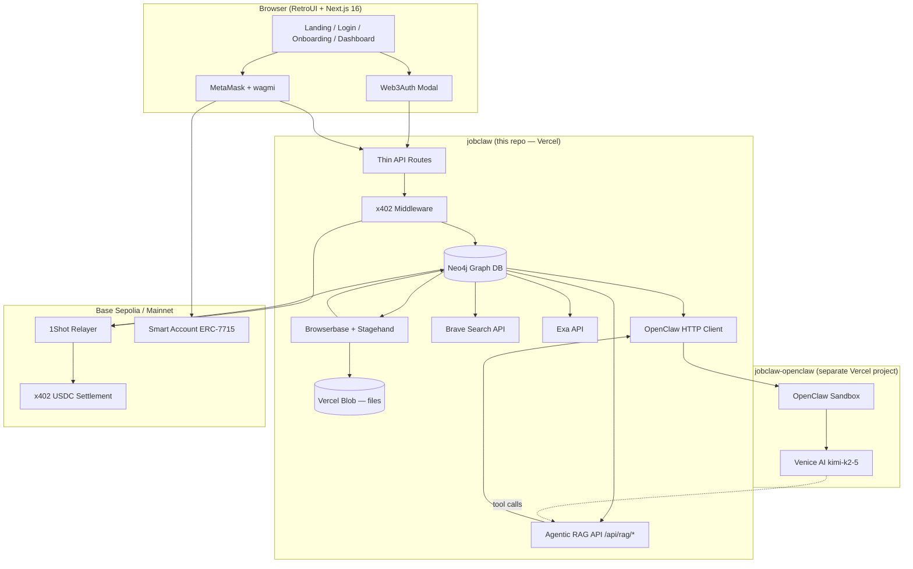

# Architecture

> **Purpose:** Technical source of truth — stack, flows, **Neo4j graph model**, env vars, deployment, skills/MCP inventory.  
> **Read when:** Backend work, integrations, auth, onchain, agent pipeline, deploy.  
> **Product scope:** `project-overview.md` · **Code patterns:** `code-standards.md` · **Library usage:** `library-docs.md`  
> **Glossary:** `context/README.md`

**JobClaw** — autonomous job-hunting agent for the **MetaMask Smart Accounts Kit × 1Shot API × Venice AI Dev Cook Off**.

Every AI agent must read **`AGENTS.md`** first, then **`context/README.md`**, then this file when doing technical work.

---

## Table of Contents

1. [High-Level System Map](#high-level-system-map)
2. [Technology Stack](#technology-stack)
3. [Dual-Repo Topology](#dual-repo-topology)
4. [Agent Tooling — Skills & MCP](#agent-tooling--skills--mcp)
5. [Folder Structure](#folder-structure)
6. [System Boundaries & Ownership](#system-boundaries--ownership)
7. [Runtime Architecture](#runtime-architecture)
8. [Data Flows](#data-flows)
9. [Neo4j for the Website](#neo4j-for-the-website)
10. [Agentic RAG — OpenClaw + Neo4j](#agentic-rag--openclaw--neo4j)
11. [Neo4j Graph Model](#neo4j-graph-model)
12. [Authentication & Authorization](#authentication--authorization)
13. [Onchain & x402 Layer](#onchain--x402-layer)
14. [Agent Pipeline (Discovery → Apply)](#agent-pipeline-discovery--apply)
15. [Environment Variables](#environment-variables)
16. [Deployment & Infrastructure](#deployment--infrastructure)
17. [Prize-Track → Component Mapping](#prize-track--component-mapping)
18. [Invariants](#invariants)

---

## High-Level System Map



**Core principle:** UI and thin routes live in Next.js. All durable state lives in **Neo4j** (graph + relationships). Files live in **Vercel Blob**. Long-running hunt/apply runs in `lib/jobs/` (server-only). Reasoning lives in OpenClaw + Venice. Browser execution lives in Browserbase — never in OpenClaw.

---

## Technology Stack

| Layer | Tool | Version / Default | Purpose |
|-------|------|-------------------|---------|
| Framework | Next.js | 16 (App Router) | Frontend, thin API routes, middleware |
| UI | RetroUI + Tailwind | v4 | Brutalist components in `components/retroui/` |
| Auth (onboarding) | Web3Auth | `@web3auth/modal` | **Primary entry** — social login, resume, preferences |
| Auth (Web3) | wagmi + viem + MetaMask SDK | latest | Wallet connect, SIWE, Smart Accounts Kit |
| Smart accounts | MetaMask Smart Accounts Kit | ERC-7715 | Scoped delegation for autonomous agent |
| Onchain relay | 1Shot Permissionless Relayer | EIP-7702 + 7710 | Upgrade + delegated execution, USDC gas |
| Payments | x402 + 1Shot facilitator | HTTP 402 | Micropayments on hunt / apply / analyze-url |
| Database | **Neo4j** | 5.x (Aura or self-hosted) | **Required** — graph DB for all app state + relationships |
| File storage | Vercel Blob | `@vercel/blob` | Resume PDFs, cover letters, screenshots (URLs in Neo4j) |
| Live UI updates | SWR polling | ~2s during active hunt | `GET /api/agent-runs/[id]` — no client-side Neo4j |
| Agent brain | OpenClaw | `@vercel/vclaw` | Reasoning sandbox + **agentic RAG** tool loop |
| LLM | Venice AI | `venice/kimi-k2-5` | Match, personalize, form answers — **retrieves from Neo4j via RAG** |
| Knowledge / RAG | **Neo4j graph** | Cypher + RAG API | **Required** — website data + OpenClaw retrieval context |
| Job discovery | Exa + LinkedIn | `exa-js` + Browserbase | Broad search + board browsing |
| URL analysis | Brave Search + Browserbase | REST API | User-pasted official job URLs |
| Browser automation | Browserbase + Stagehand | Venice as LLM | Search, extract, fill, submit |
| Deploy | Vercel | Hobby (demo OK) | Both repos |
| Chain (dev) | Base Sepolia | chainId `84532` | x402 dev payments |
| Chain (demo video) | Base mainnet | chainId `8453` | **Required for 1Shot relayer prize** |

**Removed — do not use:** InsForge, Adzuna, PostHog, Clerk, Neon, **Convex**, OpenAI GPT-4o as primary model.

---

## Dual-Repo Topology

| Repo | Create / Deploy | Owns | Must NOT own |
|------|-----------------|------|--------------|
| **`jobclaw`** (this repo) | Vercel git push or `vercel deploy` | Next.js **website**, **Neo4j** (all pages + agent data), **Agentic RAG API** (`/api/rag/*`), Vercel Blob, x402, Browserbase | Venice config, OpenClaw sandbox lifecycle |
| **`jobclaw-openclaw`** | `npx @vercel/vclaw create` | OpenClaw gateway, Venice provider, **agentic RAG tool orchestration** (calls jobclaw RAG API) | Browserbase, Stagehand, direct Neo4j writes |

```bash
# OpenClaw repo bootstrap (run once, separate directory)
npx @vercel/vclaw create \
  --scope YOUR_TEAM \
  --name jobclaw-openclaw \
  --dir ~/dev/jobclaw-openclaw \
  --clone
```

After create: configure Venice (`venice/kimi-k2-5`), allowlist `api.venice.ai` in sandbox egress, run `vclaw verify`.

---

## Agent Tooling — Skills & MCP

AI agents must use installed **skills** and **MCP servers** before guessing APIs. Authority order:

```
AGENTS.md → context/architecture.md (this file) → installed skill → Context7 MCP (Neo4j driver docs) → context/library-docs.md → training data
```

### Required reading

| Order | Document | When |
|-------|----------|------|
| 1 | `AGENTS.md` | Every session |
| 2 | `context/README.md` | Document map, glossary, task router |
| 3 | `context/progress-tracker.md` | Current status |
| 4 | `context/project-overview.md` | Product scope and demo script |
| 5 | `context/architecture.md` | System design (this file) |
| 6 | `context/code-standards.md` | Implementation patterns |
| 7 | `context/library-docs.md` | Per-library project rules |
| 8 | `context/build-plan.md` | Phase order and feature list |

### Repo-local skills (`.agents/skills/`)

These live **in this repository** and govern agent workflow. Read the relevant `SKILL.md` before acting.

| Skill | Path | Use when |
|-------|------|----------|
| **architect** | `.agents/skills/architect/SKILL.md` | Before any complex feature — align language, surface decisions, confirm plan |
| **review** | `.agents/skills/review/SKILL.md` | Before demo or when code feels off |
| **recover** | `.agents/skills/recover/SKILL.md` | Same problem persists after one fix — stop and recover |
| **imprint** | `.agents/skills/imprint/SKILL.md` | After new UI components — capture patterns |
| **remember** | `.agents/skills/remember/SKILL.md` | Multi-session features — save/restore state |
| **fetch** | `.agents/skills/fetch/SKILL.md` | Structured external data fetching patterns |
| **functions** | `.agents/skills/functions/SKILL.md` | Serverless / function patterns reference |

**Slash commands** (from `AGENTS.md`): `/architect`, `/review`, `/recover`, `/imprint`, `/remember save`, `/remember restore`.

### Global skills (`~/.agents/skills/` + `~/.claude/skills/`)

Installed **locally on the developer machine**. Read the skill file before implementing in that domain.

| Skill | Path | JobClaw use |
|-------|------|-------------|
| **deploy-to-vercel** | `~/.agents/skills/deploy-to-vercel/SKILL.md` | Deploy previews, link project, env vars |
| **web3auth** | `~/.agents/skills/web3auth/SKILL.md` | Web3Auth modal, social login, embedded wallets |
| **ai-sdk** | `~/.agents/skills/ai-sdk/SKILL.md` | If adding Vercel AI SDK helpers |
| **context7** | `~/.agents/skills/context7/SKILL.md` | Context7 REST fallback when MCP unavailable |
| **vercel-react-best-practices** | `~/.claude/skills/vercel-react-best-practices/SKILL.md` | React/Next performance patterns |
| **frontend-design** | `~/.claude/skills/frontend-design/SKILL.md` | Distinctive UI when extending RetroUI |
| **systematic-debugging** | `~/.claude/skills/systematic-debugging/SKILL.md` | Structured debug when `/recover` triggers |
| **writing-plans** / **executing-plans** | `~/.claude/skills/writing-plans/`, `executing-plans/` | Multi-phase implementation |
| **browser** | `~/.agents/skills/browser/SKILL.md` | Local browser automation reference |

### Vercel plugin skills (global — via Vercel CLI / plugin)

Installed with the **Vercel Claude plugin**. Path on this machine:

`~/.claude/plugins/cache/claude-plugins-official/vercel/0.42.1/skills/`

**Always load the relevant Vercel skill before touching that area.** Key skills for JobClaw:

| Skill | Use for |
|-------|---------|
| `nextjs` | App Router, Server Components, middleware, caching |
| `next-cache-components` | PPR, `use cache`, cache tags |
| `vercel-functions` | Route handlers, timeouts, Fluid Compute |
| `deployments-cicd` | Preview vs production, build logs |
| `env-vars` | `NEXT_PUBLIC_*` vs server secrets |
| `auth` | Marketplace auth patterns (reference only — we use Web3Auth + MetaMask) |
| `ai-sdk` / `ai-gateway` | AI provider routing if needed |
| `workflow` | Durable workflows (future cron orchestration) |
| `vercel-cli` | `vercel deploy`, `vercel env`, `vercel link` |
| `bootstrap` | First-time repo + Vercel linking |
| `shadcn` | RetroUI/shadcn registry installs |
| `turbopack` | Dev server / build issues |

Use **`npx vercel`** (globally or via npx) for CLI operations — see `deploy-to-vercel` skill for the full deploy flow.

### Required MCP servers

MCP tools are available in Cursor. **Read tool schema in `mcps/<server>/tools/` before calling.**

| MCP Server | Identifier | Required for | JobClaw tasks |
|------------|------------|--------------|---------------|
| **Context7** | `user-context7` | **Yes — library docs** | **Neo4j driver**, Next.js, Web3Auth, MetaMask Kit, Stagehand, x402, Venice |
| **Vercel** | `plugin-vercel-vercel` | **Yes — deploy & platform** | Deploy, env vars, build logs, Vercel Blob |
| **Cursor IDE Browser** | `cursor-ide-browser` | Demo / E2E verification | Manual UI testing — **not** production apply (use Browserbase) |
| **Playwright** | `user-playwright` | Optional — automated E2E | Login flow, dashboard smoke tests |
| **Chrome DevTools** | `user-chrome-devtools` | Optional — debug | Network/console during auth/x402 debug |
| **Filesystem** | `user-filesystem` | Optional | Bulk file reads when exploring |

**Neo4j workflow** (mandatory for database work):

1. Read **Graph Model** section below before writing Cypher.
2. Use **Context7** — `resolve-library-id` for `neo4j-javascript-driver`, then `query-docs`.
3. All access through `lib/neo4j/client.ts` + `lib/neo4j/repositories/*` — never scatter driver calls.
4. Run constraints via `scripts/neo4j-init.cypher` on fresh Aura instance.
5. Verify with Neo4j Browser or `cypher-shell` after schema changes.

**Context7 workflow** (mandatory for third-party library API docs):

1. `resolve-library-id` with library name + question (e.g. `neo4j javascript driver`)
2. Pick best match (`/org/project`, High reputation preferred)
3. `query-docs` with full question — not single keywords
4. Implement using fetched docs

**Vercel MCP workflow** (mandatory for deploy/debug):

1. `search_vercel_documentation` for platform questions
2. `deploy_to_vercel` / `get_deployment_build_logs` when deploying
3. `get_runtime_logs` when debugging production/preview

**Do not use MCP browser tools for autonomous job apply** — production automation runs on Browserbase + Stagehand in `lib/jobs/` only.

---

## Folder Structure

```
/
├── AGENTS.md                           → Agent operating manual (read first)
├── .agents/skills/                     → Repo workflow skills (architect, review, recover…)
├── context/                            → All agent context docs
│   ├── architecture.md                 → This file
│   ├── project-overview.md
│   ├── code-standards.md
│   ├── library-docs.md
│   ├── build-plan.md
│   ├── progress-tracker.md
│   ├── ui-tokens.md
│   ├── ui-rules.md
│   └── ui-registry.md
├── app/
│   ├── layout.tsx                      → Fonts (Archivo Black, Space Grotesk), providers
│   ├── globals.css                     → RetroUI CSS variables
│   ├── page.tsx                        → Landing
│   ├── login/page.tsx                  → Web3Auth primary entry
│   ├── onboarding/
│   │   ├── page.tsx                    → Resume + preferences + consent
│   │   ├── connect-wallet/page.tsx     → MetaMask upgrade + SIWE
│   │   └── permissions/page.tsx        → Smart Accounts Kit + ERC-7715
│   ├── dashboard/
│   │   ├── page.tsx                    → Stats + live logs
│   │   ├── hunt/page.tsx               → Hunt / paste URL / LinkedIn trigger
│   │   ├── onchain/page.tsx            → Tx table + explorer links
│   │   └── applications/[id]/page.tsx  → Match reason + personalized docs
│   └── api/
│       ├── auth/
│       │   ├── web3auth/route.ts       → idToken verify, session cookie
│       │   └── verify/route.ts         → SIWE verify, link wallet
│       ├── jobs/
│       │   ├── hunt/route.ts           → x402-gated hunt → lib/jobs/jobHunt
│       │   ├── analyze-url/route.ts    → x402-gated URL analyze + apply
│       │   └── apply/[listingId]/route.ts
│       ├── agent-runs/
│       │   ├── route.ts                → List active runs (Neo4j)
│       │   └── [id]/route.ts           → Poll run + logs (SWR target)
│       ├── rag/                        → Agentic RAG API for OpenClaw
│       │   ├── profile/route.ts
│       │   ├── resume/route.ts
│       │   ├── job/[listingId]/route.ts
│       │   ├── match/route.ts
│       │   └── applications/route.ts
│       ├── uploads/resume/route.ts     → Vercel Blob upload
│       └── webhooks/1shot/route.ts     → Relayer tx status
├── lib/
│   ├── neo4j/
│   │   ├── client.ts                   → Driver singleton (server-only)
│   │   ├── repositories/               → Cypher per domain
│   │   │   ├── users.ts, applications.ts, agentRuns.ts
│   │   │   ├── jobListings.ts, onchainLogs.ts, delegations.ts
│   │   │   └── ...
│   │   └── types.ts                    → Node/relationship TypeScript types
│   ├── rag/
│   │   ├── queries.ts                  → Cypher for each RAG tool
│   │   ├── formatters.ts               → JSON context for Venice prompts
│   │   └── types.ts
│   ├── jobs/
│   │   ├── jobHunt.ts                  → Exa + LinkedIn + rank + apply loop
│   │   ├── analyzeAndApply.ts          → Brave + Browserbase + personalize
│   │   └── personalizeDocuments.ts
│   ├── storage/blob.ts                 → Vercel Blob helpers
│   ├── metamask/                       → siwe.ts, smartAccount.ts, permissions.ts
│   ├── web3auth/                       → provider.tsx, config.ts, verifyIdToken.ts
│   ├── openclaw/client.ts              → ensureRunning(), rankJobs(), personalize()
│   ├── x402/middleware.ts, facilitator.ts
│   ├── onchain/relayer.ts              → 1Shot client
│   ├── automation/
│   │   ├── exa-search.ts, brave-search.ts, linkedin-search.ts
│   │   ├── job-url-analyze.ts, stagehand-apply.ts, apply-pipeline.ts
│   │   └── session-manager.ts
│   └── utils.ts                        → MATCH_THRESHOLD = 70
├── scripts/
│   └── neo4j-init.cypher               → Constraints, indexes, seed (dev)
├── components/
│   ├── retroui/                        → 38 RetroUI components
│   ├── layout/, auth/, dashboard/, onboarding/
├── providers/Web3Provider.tsx          → Web3Auth + wagmi (no Neo4j on client)
└── middleware.ts                       → Session protection
```

---

## System Boundaries & Ownership

| Layer | Owns | Forbidden |
|-------|------|-----------|
| `app/` | Pages, layouts, thin route handlers | Business logic, DB calls, Browserbase |
| `lib/neo4j/` | All Cypher, graph writes/reads | Client components, browser |
| `lib/jobs/` | Long-running hunt/apply orchestration | UI components |
| `lib/rag/` | Agentic RAG Cypher + formatters for OpenClaw | Client exposure |
| `lib/jobs/` | Long-running hunt/apply orchestration | UI components |
| `lib/automation/` | Exa, Brave, LinkedIn, Stagehand, Browserbase | UI, Neo4j schema |
| `lib/openclaw/` | HTTP client to OpenClaw sandbox | Browser automation |
| `lib/metamask/` | SIWE, Smart Accounts Kit, ERC-7715 | Web3Auth token logic |
| `lib/x402/` | 402 responses, payment verification | Hunt ranking logic |
| `components/` | Presentation only | Direct Neo4j or external API calls |
| `jobclaw-openclaw` | Venice reasoning, **agentic RAG tool calls** | Browserbase, direct Neo4j writes, x402 |

**Call direction rules:**

- `app/api/*` → verify auth/x402 → create `AgentRun` in Neo4j → kick `lib/jobs/*` (async) → return `{ runId }`
- `lib/jobs/*` → call `lib/automation/*`, `lib/openclaw/*` → write nodes/relationships via `lib/neo4j/repositories/*`
- Client polls `GET /api/agent-runs/[id]` during active hunts (SWR ~2s)
- OpenClaw client → POST to external sandbox only — never Stagehand

---

## Runtime Architecture

### Process model

| Runtime | Workload | Max duration | Examples |
|---------|----------|--------------|----------|
| Next.js Server Component | SSR, static data | Request-bound | Landing, dashboard shell |
| Next.js Route Handler | Auth, x402, kick jobs | ≤ 5 min (Hobby) | `/api/jobs/hunt` |
| Neo4j read (repository) | Graph queries | Fast | `applications.listByUser` |
| Neo4j write (repository) | Create/update nodes | Fast | User upsert, append LogEntry |
| `lib/jobs/*` | External I/O pipelines | Long (async) | jobHunt, analyzeAndApply |
| Vercel Cron | Scheduled | Periodic | `/api/cron/status-check` |
| SWR client poll | Live logs during hunt | ~2s interval | `/api/agent-runs/[id]` |
| Browserbase Session | Browser automation | 2–5 min | LinkedIn search, form fill |
| OpenClaw Sandbox | LLM reasoning | Cold ~60s, warm ~10s | Job ranking, personalization |

### State ownership

| State | Source of truth | Live updates |
|-------|-----------------|--------------|
| User session | httpOnly cookie + Neo4j `User` node | No |
| Resume PDF | Vercel Blob (`blobUrl` on `Resume` node) | No |
| Job listings | Neo4j `JobListing` nodes | SWR refetch |
| Applications | Neo4j `Application` nodes + relationships | SWR poll during hunt |
| Agent logs | Neo4j `LogEntry` nodes linked to `AgentRun` | SWR poll ~2s |
| Onchain events | Neo4j `OnchainLog` nodes | SWR refetch |
| x402 payments | Neo4j `X402Payment` nodes | SWR refetch |
| Venice output | Properties on `Application` node | No |

---

## Data Flows

### Flow A — Web3Auth onboarding (primary entry)

```
/login
  → Web3Auth modal (Google / GitHub / email)
  → POST /api/auth/web3auth (verify idToken via jose + JWKS)
  → httpOnly session cookie
  → Neo4j MERGE User + SET properties (usersRepository.upsertFromWeb3Auth)
  → /onboarding (resume PDF → Vercel Blob, job preferences, consent)
  → Dashboard (limited) + WalletUpgradeBanner
```

### Flow B — MetaMask upgrade (hackathon prize path)

```
/onboarding/connect-wallet
  → wagmi connect MetaMask
  → personal_sign SIWE message
  → POST /api/auth/verify (link wallet to existing Web3Auth user)
  → /onboarding/permissions
      → toMetaMaskSmartAccount()
      → ERC-7715 Advanced Permissions prompt
      → EIP-7702 upgrade via 1Shot relayer
      → Neo4j Delegation + OnchainLog nodes
  → Full dashboard unlocked (hunt, apply, onchain)
```

**Direct MetaMask login** on `/login` skips Web3Auth but still requires resume + permissions funnel.

### Flow C — Autonomous hunt (Exa + LinkedIn + x402)

```
/dashboard/hunt → POST /api/jobs/hunt
  → x402 middleware: 402 + Payment-Required
  → Client/delegated wallet signs → retry with X-PAYMENT
  → 1Shot facilitator settles USDC → Neo4j OnchainLog + X402Payment nodes
  → lib/jobs/jobHunt (async):
      1. openclaw.ensureRunning()
      2. parallel: exa.searchJobs() + linkedin.searchJobs() [Browserbase]
      3. openclaw.rankJobs() → MERGE JobListing nodes + MATCH relationships
      4. for each match (max 3, score >= 70):
           a. braveSearch.enrich()
           b. openclaw.personalize() → Vercel Blob (cover letter + resume)
           c. stagehand.apply()
           d. CREATE Application, LogEntry nodes
  → UI polls GET /api/agent-runs/[id] (SWR ~2s)
```

### Flow D — User-pasted job URL (Brave + Browserbase + Venice)

```
User pastes official URL on /dashboard/hunt
  → POST /api/jobs/analyze-url (x402-gated)
  → lib/jobs/analyzeAndApply (async):
      1. braveSearch.query(company + title from URL)
      2. Browserbase → Stagehand extract(requirements, form schema)
      3. OpenClaw/Venice → matchScore, matchReason, cover letter, resume variant
      4. Vercel Blob: coverLetterUrl, personalizedResumeUrl
      5. Stagehand fill + submit
      6. CREATE Application + LogEntry nodes in Neo4j
```

### Flow E — OpenClaw + Agentic RAG (external repo)

```
lib/openclaw/client.ts
  → POST {OPENCLAW_BASE_URL}/api/status (wake sandbox)
  → Gateway chat with Venice (venice/kimi-k2-5)
  → Venice agent uses RAG tools (agentic loop):
      1. query_user_profile(userId)     → GET jobclaw /api/rag/profile
      2. query_resume_skills(userId)    → GET jobclaw /api/rag/skills
      3. query_job_context(listingId)   → GET jobclaw /api/rag/job/{id}
      4. query_skill_match(userId, id)  → GET jobclaw /api/rag/match
      5. query_apply_history(userId)    → GET jobclaw /api/rag/applications
  → Each RAG endpoint runs Cypher on Neo4j → returns JSON context
  → Venice synthesizes: matchScore, matchReason, coverLetter, resumeVariant
  → jobclaw stores results on Application node in Neo4j
  → NEVER calls Browserbase from OpenClaw
```

**Agentic** = Venice **decides which** RAG tools to call and in what order — not a fixed retrieve-then-prompt pipeline.

---

## Neo4j for the Website

**Neo4j is the single backend for the entire JobClaw website.** Every page reads from the graph via server-side repositories or API routes — never mock data, never Convex, never client-side DB driver.

### Page → Neo4j mapping

| Page | Neo4j data loaded |
|------|-------------------|
| `/dashboard` | `Application` count, recent `AgentRun`, `OnchainLog` summary |
| `/dashboard/hunt` | `JobProfile`, active `AgentRun`, past hunts |
| `/dashboard/onchain` | `OnchainLog`, `X402Payment` nodes |
| `/dashboard/applications/[id]` | `Application` → `FOR_JOB` → `JobListing`, skill match subgraph |
| `/onboarding` | `JobProfile`, `Resume` nodes |
| `/profile` | `User`, `JobProfile`, `Resume`, `Delegation` |

### Website data access rules

1. **Server Components** — call `lib/neo4j/repositories/*` directly (with session `userId`).
2. **Client Components** — fetch `/api/*` routes that query Neo4j server-side.
3. **Never** expose `NEO4J_URI` or driver to the browser.
4. **SWR polling** — only for live `AgentRun` + `LogEntry` during hunts.
5. All writes (upload resume, start hunt, apply) → API route → Neo4j repository.

```typescript
// app/dashboard/page.tsx (Server Component example)
import { applicationsRepository } from "@/lib/neo4j/repositories/applications";
import { getSessionUserId } from "@/lib/auth/session";

export default async function DashboardPage() {
  const userId = await getSessionUserId();
  const stats = await applicationsRepository.getStats(userId);
  return <DashboardStats stats={stats} />;
}
```

---

## Agentic RAG — OpenClaw + Neo4j

OpenClaw's Venice agent uses **agentic RAG**: the LLM autonomously chooses which graph queries to run against Neo4j (via jobclaw's RAG API) before ranking jobs, personalizing resumes, or writing cover letters.

### Why graph RAG (not vector-only)

| Approach | JobClaw use |
|----------|-------------|
| **Graph traversal** | Skill overlap, apply history, user ↔ job relationships — **primary** |
| Vector embeddings | Optional future — `DocumentChunk` nodes on `Resume.parsedText` / `JobListing.description` |

Judges see: "Venice retrieved your React skills from the graph and matched them to this job's requirements."

### RAG API (`jobclaw` repo)

All endpoints: `Authorization: Bearer ${RAG_API_SECRET}` (shared with OpenClaw sandbox).

| Endpoint | Returns | Cypher purpose |
|----------|---------|----------------|
| `GET /api/rag/profile?userId=` | titles, locations, remote, consent | `User` → `HAS_PROFILE` → `JobProfile` |
| `GET /api/rag/resume?userId=` | parsedText, skills[] | `User` → `HAS_RESUME` → `HAS_SKILL` → `Skill` |
| `GET /api/rag/job/[listingId]` | title, company, description, requirements | `JobListing` → `REQUIRES` → `Skill` |
| `GET /api/rag/match?userId=&listingId=` | matchedSkills[], missingSkills[], score hint | skill overlap subgraph |
| `GET /api/rag/applications?userId=` | recent applies, statuses | `APPLIED_TO` history |
| `POST /api/rag/context` | custom bundle for agent | body: `{ userId, listingId, tools: [...] }` |

### OpenClaw tool definitions (`jobclaw-openclaw` repo)

Register as OpenClaw tools pointing at jobclaw RAG API:

```json
{
  "name": "query_skill_match",
  "description": "Get skill overlap between user resume and a job listing from Neo4j graph",
  "parameters": { "userId": "string", "listingId": "string" }
}
```

Venice agent loop:
1. Receive task (rank jobs / personalize application)
2. **Decide** which RAG tools to invoke
3. Call jobclaw `/api/rag/*` → receive graph context
4. Reason with Venice → output structured JSON
5. jobclaw persists output to Neo4j `Application` node

### Implementation files

```
jobclaw/
├── lib/rag/
│   ├── queries.ts          → Cypher for each RAG tool
│   ├── formatters.ts       → JSON context for Venice prompts
│   └── types.ts
├── app/api/rag/
│   ├── profile/route.ts
│   ├── resume/route.ts
│   ├── job/[listingId]/route.ts
│   ├── match/route.ts
│   └── applications/route.ts

jobclaw-openclaw/
├── tools/rag-tools.json    → OpenClaw tool manifest → jobclaw URLs
└── openclaw.config.*       → Venice + tool calling enabled
```

### RAG security

- `RAG_API_SECRET` — only OpenClaw sandbox + jobclaw server know it
- Every RAG query scoped to `userId` — OpenClaw passes `userId` from hunt session
- Never return cross-user graph data
- Log RAG tool calls as `LogEntry` with `phase: "rag_retrieve"` for demo visibility

---

## Neo4j Graph Model

**Required.** All app state is nodes + relationships. Files (PDF, screenshots) are **Vercel Blob URLs** on nodes — never store binaries in Neo4j.

### Node labels and properties

| Label | Key properties | Notes |
|-------|----------------|-------|
| `User` | `id`, `walletAddress?`, `smartAccountAddress?`, `web3authSub?`, `email?`, `authMethod`, `onboardingStep`, `createdAt` | Root entity per person |
| `JobProfile` | `id`, `titles[]`, `locations[]`, `salaryMin?`, `salaryMax?`, `remotePreference`, `consentGranted` | Job search preferences |
| `Resume` | `id`, `blobUrl`, `parsedText?`, `uploadedAt` | Base resume PDF in Vercel Blob |
| `Skill` | `name` | Normalized skill tag for graph matching |
| `Delegation` | `id`, `erc7715Permission` (JSON string), `erc7710Caveats` (JSON), `expiresAt`, `status` | ERC-7715 grant |
| `JobListing` | `id`, `title`, `company`, `url`, `description`, `source`, `matchScore?`, `braveContext?`, `discoveredAt` | `source`: `exa` \| `linkedin` \| `url` |
| `Application` | `id`, `status`, `matchScore`, `matchReason`, `veniceModel`, `coverLetterUrl?`, `personalizedResumeUrl?`, `screenshotUrl?`, `browserbaseSessionId?`, `errorMessage?` | Status flow: discovered → matched → personalizing → applying → submitted \| failed |
| `AgentRun` | `id`, `runType`, `phase`, `openclawLatencyMs?`, `startedAt`, `completedAt?` | `runType`: hunt \| analyze_url \| apply_single |
| `LogEntry` | `id`, `timestamp`, `phase`, `message`, `level?`, `txHash?`, `veniceModel?` | Append-only — one node per log line |
| `OnchainLog` | `id`, `type`, `txHash`, `chainId`, `amountUsdc?`, `explorerUrl`, `createdAt` | type: permission_grant \| x402_payment \| relayer_exec |
| `BrowserSession` | `id`, `browserbaseSessionId`, `board`, `status`, `replayUrl?`, `lastSyncedAt` | |
| `X402Payment` | `id`, `resourcePath`, `amount`, `txHash?`, `settledAt?` | Audit trail |

### Relationships

```cypher
(User)-[:HAS_PROFILE]->(JobProfile)
(User)-[:HAS_RESUME]->(Resume)
(Resume)-[:HAS_SKILL]->(Skill)
(JobListing)-[:REQUIRES]->(Skill)
(User)-[:HAS_DELEGATION]->(Delegation)
(User)-[:DISCOVERED]->(JobListing)
(User)-[:APPLIED_TO]->(Application)-[:FOR_JOB]->(JobListing)
(User)-[:RAN]->(AgentRun)-[:HAS_LOG]->(LogEntry)
(User)-[:HAS_ONCHAIN]->(OnchainLog)
(User)-[:HAS_PAYMENT]->(X402Payment)
(Application)-[:USED_SESSION]->(BrowserSession)
```

### Graph matching (demo narrative)

Venice ranks jobs; graph **confirms** skill overlap for judges:

```cypher
MATCH (u:User {id: $userId})-[:HAS_RESUME]->(r:Resume)-[:HAS_SKILL]->(s:Skill)
      <-[:REQUIRES]-(j:JobListing)<-[:FOR_JOB]-(a:Application)
WHERE a.status = 'submitted'
RETURN j.title, collect(s.name) AS matchedSkills
```

### Constraints (`scripts/neo4j-init.cypher`)

```cypher
CREATE CONSTRAINT user_id IF NOT EXISTS FOR (u:User) REQUIRE u.id IS UNIQUE;
CREATE CONSTRAINT job_listing_id IF NOT EXISTS FOR (j:JobListing) REQUIRE j.id IS UNIQUE;
CREATE CONSTRAINT application_id IF NOT EXISTS FOR (a:Application) REQUIRE a.id IS UNIQUE;
CREATE CONSTRAINT agent_run_id IF NOT EXISTS FOR (r:AgentRun) REQUIRE r.id IS UNIQUE;
CREATE INDEX user_wallet IF NOT EXISTS FOR (u:User) ON (u.walletAddress);
CREATE INDEX user_web3auth IF NOT EXISTS FOR (u:User) ON (u.web3authSub);
```

### Repository pattern

```typescript
// lib/neo4j/client.ts — server-only singleton
import neo4j from "neo4j-driver";
export function getDriver() {
  return neo4j.driver(
    process.env.NEO4J_URI!,
    neo4j.auth.basic(process.env.NEO4J_USERNAME!, process.env.NEO4J_PASSWORD!)
  );
}

// lib/neo4j/repositories/agentRuns.ts
export async function appendLog(runId: string, entry: LogEntryInput) {
  await session.run(`
    MATCH (r:AgentRun {id: $runId})
    CREATE (l:LogEntry {id: randomUUID(), ...})
    CREATE (r)-[:HAS_LOG]->(l)
  `, { runId, ...entry });
}
```

---

## Authentication & Authorization

### Capability matrix

| Capability | Web3Auth only | MetaMask + delegation |
|------------|---------------|------------------------|
| Resume upload | ✅ | ✅ |
| Job preferences | ✅ | ✅ |
| Browse listings | ✅ | ✅ |
| Paste URL preview | ✅ (read-only analyze) | ✅ |
| Start hunt (x402) | ❌ → upgrade prompt | ✅ |
| Autonomous apply | ❌ | ✅ |
| Onchain panel | ❌ | ✅ |
| ERC-7715 delegation | ❌ | ✅ |

### Session model

- **Web3Auth:** idToken verified server-side → signed httpOnly session cookie (`SESSION_SECRET`)
- **MetaMask:** SIWE `personal_sign` → `/api/auth/verify` → same cookie format, wallet linked
- **Middleware:** `middleware.ts` checks session on `/dashboard/*`, `/onboarding/*`
- **Neo4j auth:** Pass `userId` from session into every repository call — filter `MATCH (u:User {id: $userId})`

### Prize-critical onchain (MetaMask path only)

1. `toMetaMaskSmartAccount()` via Smart Accounts Kit
2. ERC-7715 Advanced Permissions request (visible in demo video)
3. EIP-7702 upgrade via 1Shot Permissionless Relayer
4. ERC-7710 delegation for x402 agent payments
5. Webhook at `/api/webhooks/1shot` for tx status (preferred over polling)

---

## Onchain & x402 Layer

### Priced actions (MVP)

| Route | Price (USDC) | Triggers |
|-------|--------------|----------|
| `POST /api/jobs/hunt` | $0.05 | Full discovery + up to 3 applies |
| `POST /api/jobs/analyze-url` | $0.05 | URL analyze + single apply |
| `POST /api/jobs/apply/[listingId]` | $0.10 | Single re-apply |

### x402 sequence

```
Client POST (no payment)
  → 402 + WWW-Authenticate / payment requirements header
  → Delegated smart account signs EIP-3009 authorization
  → Client retries with X-PAYMENT header
  → lib/x402/facilitator.ts → 1Shot verify + settle
  → Write X402Payment + OnchainLog nodes in Neo4j
  → Route kicks lib/jobs/* (async)
```

---

## Agent Pipeline (Discovery → Apply)

### Personalization (Venice via OpenClaw)

Before every apply:

1. Input: base resume text + job description + braveContext
2. Output: `matchScore`, `matchReason`, `coverLetter`, `resumeVariant` (markdown or structured)
3. Store model id: `venice/kimi-k2-5`
4. Render resume variant to PDF if needed → Vercel Blob

### Browserbase + Stagehand

```typescript
// lib/automation/stagehand-apply.ts
const stagehand = new Stagehand({
  env: "BROWSERBASE",
  apiKey: process.env.BROWSERBASE_API_KEY!,
  projectId: process.env.BROWSERBASE_PROJECT_ID!,
  model: {
    modelName: "openai/kimi-k2-5",
    apiKey: process.env.VENICE_API_KEY!,
    baseURL: "https://api.venice.ai/api/v1",
  },
});
```

**Supported targets:** LinkedIn (search + apply), Greenhouse, Lever, direct career URLs.

**Rules:** always `stagehand.close()` in `finally`; max 3 applies per hunt; try/catch every `act()` / `extract()`; store replay URL when available.

### Brave Search

```typescript
// lib/automation/brave-search.ts
GET https://api.search.brave.com/res/v1/web/search
Header: X-Subscription-Token: BRAVE_SEARCH_API_KEY
```

Used for company/role context when user supplies a URL or before personalization.

### Match threshold

```typescript
// lib/utils.ts
export const MATCH_THRESHOLD = 70;
```

Only auto-apply when Venice `matchScore >= MATCH_THRESHOLD`.

---

## Environment Variables

| Variable | Scope | Purpose |
|----------|-------|---------|
| `NEO4J_URI` | Server | `neo4j+s://xxx.databases.neo4j.io` (Aura) |
| `NEO4J_USERNAME` | Server | `neo4j` |
| `NEO4J_PASSWORD` | Server | Aura password |
| `BLOB_READ_WRITE_TOKEN` | Server | Vercel Blob for PDFs/screenshots |
| `NEXT_PUBLIC_WEB3AUTH_CLIENT_ID` | Public | Web3Auth dashboard |
| `SESSION_SECRET` | Server | Cookie signing |
| `NEXT_PUBLIC_CHAIN_ID` | Public | `84532` dev / `8453` mainnet demo |
| `VENICE_API_KEY` | Server | Stagehand LLM + Venice API |
| `BROWSERBASE_API_KEY` | Server | Browser automation |
| `BROWSERBASE_PROJECT_ID` | Server | Browserbase project |
| `EXA_API_KEY` | Server | Job discovery |
| `BRAVE_SEARCH_API_KEY` | Server | URL enrichment |
| `RAG_API_SECRET` | Server | Auth between OpenClaw sandbox and `/api/rag/*` |
| `JOBCLAW_BASE_URL` | Server (openclaw repo) | OpenClaw calls this for RAG (e.g. `https://jobclaw.vercel.app`) |
| `OPENCLAW_BASE_URL` | Server (jobclaw repo) | jobclaw wakes OpenClaw sandbox |
| `OPENCLAW_ADMIN_SECRET` | Server | Wake / admin auth |
| `OPENCLAW_BYPASS_SECRET` | Server | Vercel deployment protection bypass |
| `ONESHOT_API_KEY` | Server | 1Shot relayer |
| `ONESHOT_API_SECRET` | Server | 1Shot signing |
| `X402_USDC_ADDRESS` | Server | USDC contract on Base |
| `X402_RECIPIENT_ADDRESS` | Server | Payment recipient |

Never commit secrets. `NEXT_PUBLIC_*` only for browser-safe values.

---

## Deployment & Infrastructure

| Service | Deploy target | Notes |
|---------|---------------|-------|
| `jobclaw` | Vercel Hobby | Main app — use `deploy-to-vercel` skill |
| `jobclaw-openclaw` | Vercel via `vclaw create` | Separate project |
| Neo4j Aura | neo4j.com/cloud | Free tier for hackathon — run `scripts/neo4j-init.cypher` |
| Vercel Blob | Vercel dashboard | Resume, cover letter, screenshot storage |
| Browserbase | Cloud API | Sessions created per action |
| 1Shot | API | Mainnet for final demo video |

### Pre-demo checklist

- [ ] OpenClaw sandbox pre-warmed (`POST /api/status`)
- [ ] 2 applications pre-seeded in Neo4j
- [ ] Mainnet delegation + x402 tested for 1Shot prize
- [ ] Venice model id visible in UI
- [ ] Browserbase replay URL ready as backup proof

---

## Prize-Track → Component Mapping

| Prize track | Architectural proof | UI surface |
|-------------|----------------------|------------|
| **Best Agent** | Neo4j `AgentRun` + `Application` graph pipeline | Live log drawer, application timeline |
| **Best Venice AI** | OpenClaw agentic RAG + `venice/kimi-k2-5` retrieving from Neo4j | Match reason cites graph skills, model id badge |
| **Best x402 + ERC-7710** | x402 middleware + delegated smart account | Hunt button → 402 → payment → run |
| **Best 1Shot Relayer** | 7702 upgrade + 7710 exec + webhook | Onchain panel, BaseScan links |

---

## Invariants

1. Read **`AGENTS.md`** and **`context/README.md`** before every implementation session.
2. Load the relevant **skill** (repo `.agents/skills/` or global `~/.agents/skills/`) before third-party code.
3. Use **Context7 MCP** for Neo4j driver + library docs; **Vercel MCP** for deploy/platform.
4. API routes are thin — long work in **`lib/jobs/`**; all graph writes via **`lib/neo4j/repositories/`**.
5. Browser automation **never** in OpenClaw repo.
6. Venice model id stored on every AI output (`veniceModel` field).
7. Every onchain action → `OnchainLog` node. Every agent step → append `LogEntry` node.
8. Web3Auth onboarding OK; **demo hunt/apply/onchain requires MetaMask delegation**.
9. Personalize resume + cover letter **before** every apply.
10. Never use InsForge, Adzuna, PostHog, Clerk in new code.
11. No hardcoded hex — use CSS variables from `ui-tokens.md`.
12. RetroUI components from `components/retroui/` for all new UI.
13. Always scope Neo4j queries to authenticated `userId` — never return cross-user graph data.
14. **Never use Convex** — Neo4j is required for all website + agent data.
15. **Agentic RAG** — OpenClaw retrieves from Neo4j via `/api/rag/*`; Venice decides which tools to call.
16. **Website** — every page loads data from Neo4j repositories; no mock data.
17. Update `progress-tracker.md` and `ui-registry.md` after every feature.
